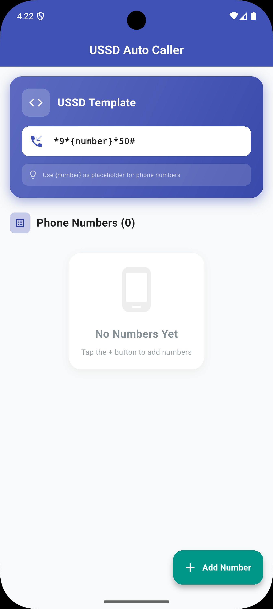

# `Auto Caller` Project Overview

The `Auto Caller` Flutter application is a tool designed to automate and streamline USSD (Unstructured Supplementary Service Data) interactions. It allows users to define customizable USSD templates, import lists of phone numbers from Excel files, and then initiate automated sequences of USSD calls using these templates and numbers. The application provides features for managing stored numbers, making single USSD calls, and offers a responsive user interface with persistent storage for templates and numbers.

## Key Features

* **Customizable USSD Templates:** Define a USSD template with a `{number}` placeholder for dynamic integration of phone numbers.
* **Excel Import for Numbers:** Easily import multiple phone numbers from Excel files.
* **Number Management:** Add, remove, and clear all stored phone numbers.
* **Automated USSD Calling:** Initiate a sequence of USSD calls with an automated delay between each call.
* **Single USSD Call Functionality:** Make individual USSD calls.
* **Persistent Data Storage:** USSD templates and imported numbers are saved locally using Hive.
* **Responsive User Interface:** Adapts to various screen sizes using `flutter_screenutil`.
* **User Feedback:** Provides clear notifications and error messages through in-app snackbars.

## Image

## Getting Started
